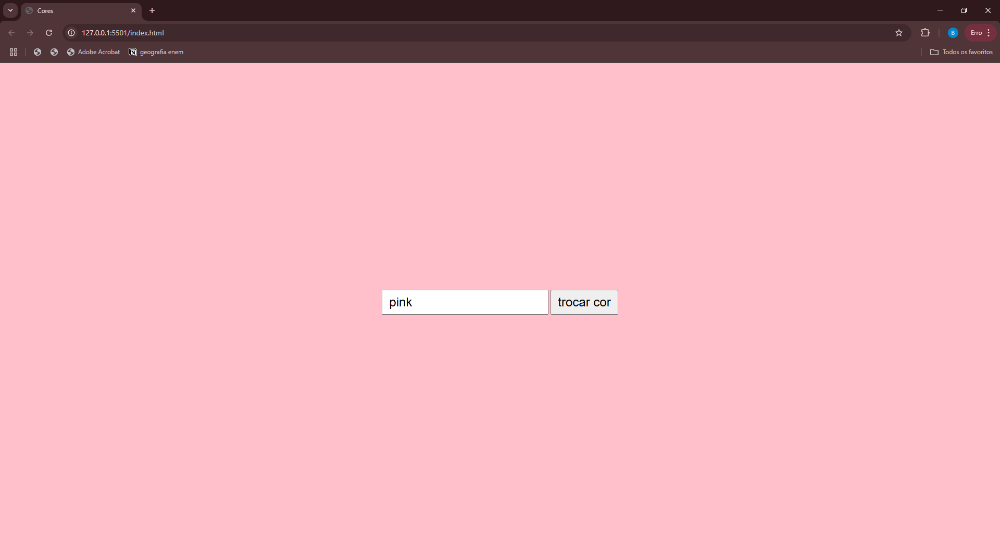

# Projeto Trocar Cor Da Página

---

## Sobre 
Projeto do curso de desenvolvimento de sistemas com o objetivo de colocar em prática os conhecimentos adquirido na aula de Front End no
 [SENAI Jandira](https://sp.senai.br/unidade/jandira/).

---
## Tecnologias utilizadas
- HTML
- CSS
- JS
- GIT
- MarkDown

---
## Autores
- [Beatriz Boletini](https://github.com/boletini)
